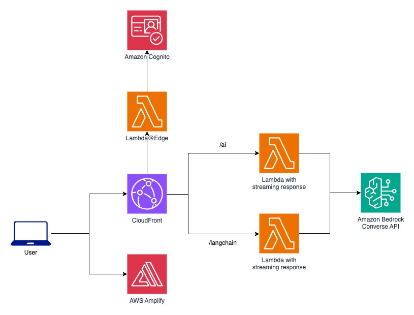

# Create an AI Assistant with AWS Amplify, Amazon Bedrock w/ Tools, AI SDK and LangChain

## Table of Contents

- [Overview](#overview)
- [Key Features](#key-features)
- [Architecture](#architecture)
- [Tech Stack](#tech-stack)
  - [Frontend](#frontend)
  - [Backend](#backend)
- [Deployment Guide](#deployment-guide)
  - [Requirements](#requirements)
  - [Deploy](#deploy)
- [Local Development](#local-development)
- [Security](#security)
- [Contributing](#contributing)
- [License](#license)

## Overview

This project demonstrates how to build an AI Assistant using AWS Amplify, Amazon Bedrock, Vercel AI SDK, and LangChain. With these tools, you can create an AI Assistant capable of providing intelligent responses and performing various tasks efficiently.

## Key Features

- **AWS Amplify Integration**: Seamlessly integrates with Amplify hosting and backend services, facilitating streamlined application deployment.
- **Amazon Bedrock**: Enhances Large Language Model (LLM) capabilities via the Amazon Bedrock Converse API, supporting features like tool calling and image summarization.
- **Serverless Streaming**: Uses AWS Lambda for response streaming, ensuring optimal performance and scalability.
- **AI SDK**: Leverages Vercel AI SDK to connect the application with the LLM, delivering a refined user experience.
- **LangChain Support**: Incorporates LangChain to leverage its comprehensive ecosystem and capabilities.

## Architecture

Below is an overview of the application architecture:



## Tech Stack

### Frontend

This application is based on the [AWS Amplify React+Vite Starter Template](https://github.com/aws-samples/amplify-vite-react-template). The design is crafted with [Tailwind CSS](https://tailwindcss.com/) and [shadcn components](https://ui.shadcn.com/), using the [dashboard-03 template](https://ui.shadcn.com/blocks#dashboard-03) for a sleek and efficient UI.

For creating a conversational user interface, the `useChat()` hook from the [Vercel AI SDK](https://sdk.vercel.ai/) is employed.

### Backend

The backend is built with AWS services:

- **Lambda Functions**: These functions call the [Bedrock Converse API](https://docs.aws.amazon.com/bedrock/latest/userguide/conversation-inference.html) to send and receive messages from Amazon Bedrock models. Node.js 20 serves as the runtime environment.
- **Model Selection**: Choose from three models supporting tool calling:
  - Anthropic Claude 3 Haiku
  - Anthropic Claude 3 Sonnet
  - Anthropic Claude 3.5 Sonnet
- **Authentication**: Managed via [Amplify Auth](https://docs.amplify.aws/react/build-a-backend/auth/) and Amazon Cognito.
- **Response Streaming**: Conversations are streamed through Lambda functions with [streaming response](https://docs.aws.amazon.com/lambda/latest/dg/configuration-response-streaming.html).

Two Lambda functions are available to interact with Bedrock Converse API:

- **AI Function**: Uses the [Vercel AI SDK](https://sdk.vercel.ai/).
- **LangChain Function**: Employs [LangChain.js](https://js.langchain.com/v0.2/docs/introduction/).

The interface allows you to select between these two frameworks and test their respective approaches.

## Deployment Guide

### Requirements

Before deploying the assistant, ensure you have access to the following foundation models on Amazon Bedrock:

- Anthropic Claude 3 Haiku
- Anthropic Claude 3 Sonnet
- Anthropic Claude 3.5 Sonnet

Refer to [this guide](https://docs.aws.amazon.com/bedrock/latest/userguide/getting-started.html#getting-started-model-access) for details. The project must be deployed in the same AWS region where these models are available.

### Deploy

To deploy the project to your AWS account, first create a repository in your GitHub account using this project as a starter:

[Create repository from template](https://github.com/new?owner=aws-samples&template_name=stream-ai-assistant-using-bedrock-converse-with-tools&template_owner=aws-samples)

Use the form in GitHub to finalize your repo's creation. Now that the repository has been created, deploy it with Amplify:

[Deploy to AWS](https://console.aws.amazon.com/amplify/create/repo-branch)

Select GitHub. After you give Amplify access to your GitHub account via the popup window, pick the repository and `main` branch to deploy. Make no other changes and click through the flow to Save and deploy.

When the build completes, visit the newly deployed branch by selecting "Visit deployed URL".

## Local Development

For local development, you'll use the Amplify [cloud sandbox](https://docs.amplify.aws/react/deploy-and-host/sandbox-environments/setup/), which offers an isolated environment with real-time updates to your cloud resources.

You'll need Node.js 20 for this:

1. Install dependencies:

   ```bash
   npm install
   ```

2. Launch the sandbox environment:

   ```bash
   npx ampx sandbox
   ```

3. Open a new terminal tab and start the development server:

   ```bash
   npm run dev
   ```

4. You can now access [http://localhost:5173](http://localhost:5173) and make changes.

## Security

This project leverages Lambda functions to stream responses using [Lambda URLs](https://docs.aws.amazon.com/lambda/latest/dg/urls-configuration.html). These functions are protected behind a CloudFront distribution, with a Lambda@Edge function in place to verify user access tokens.

To further secure these endpoints, it's advisable to implement [AWS WAF](https://docs.aws.amazon.com/waf/). Refer to the documentation for guidance on adding WAF to your CloudFront distribution.

CORS settings are permissive by default to facilitate deployment. You can improve security by only allowing your application's domain to access the `/ai` and `/langchain` endpoints.

Currently, all CloudFront distributions within your AWS account have permission to invoke the Lambda URLs. For increased security, you can limit this permission to only the specific CloudFront distribution used by this project. To avoid a circular reference error, an additional deployment step is required. You can use the `aws lambda add-permission` CLI command for this purpose, as detailed in [this documentation](https://docs.aws.amazon.com/AmazonCloudFront/latest/DeveloperGuide/private-content-restricting-access-to-lambda.html).

## Contributing

See [CONTRIBUTING](CONTRIBUTING.md) for more information.

## License

This library is licensed under the MIT-0 License. See the [LICENSE file](LICENSE).
